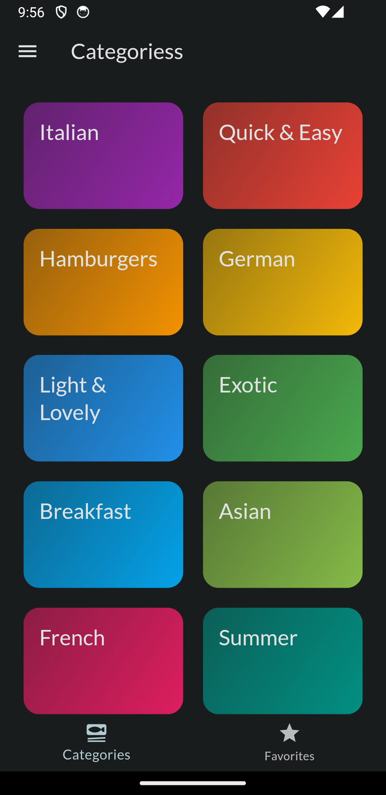
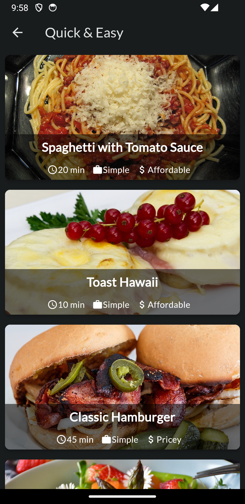

# Meal App

MyApp is a Flutter application that allows users to manage their meals and recipes.

## Features

- View a list of meals with details such as name, category, and affordability.
- Filter meals based on categories such as breakfast, lunch, dinner, etc.
- Mark meals as favorites and access them easily.
- Add new meals with custom recipes and details.
- Search for meals by name or ingredients.

## Installation

1. Clone the repository: `git clone https://github.com/ismailariyan/meals_app.git`
2. Navigate to the project directory: `cd myapp`
3. Install dependencies: `flutter pub get`
4. Run the app: `flutter run`

## Screenshots

## Dependencies

- Riverpod

## Contributing

Contributions are welcome! If you find any bugs or have suggestions for improvements, please open an issue or submit a pull request.
